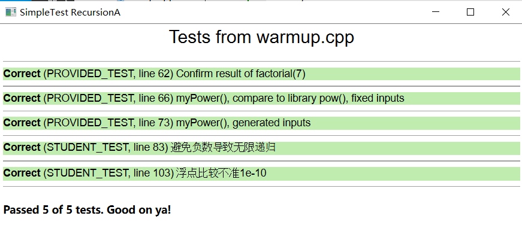
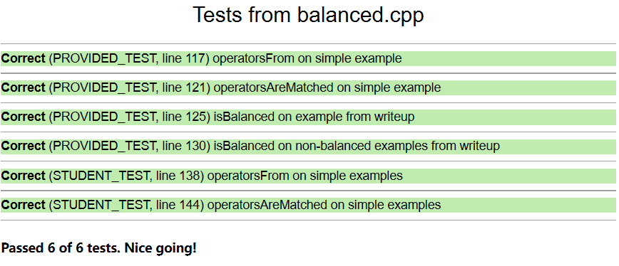
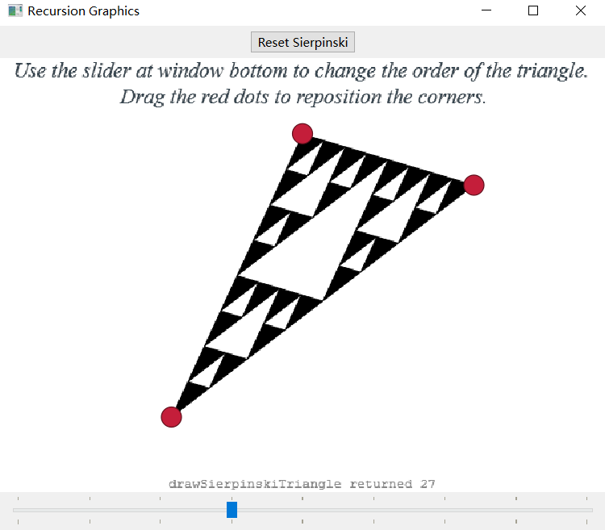
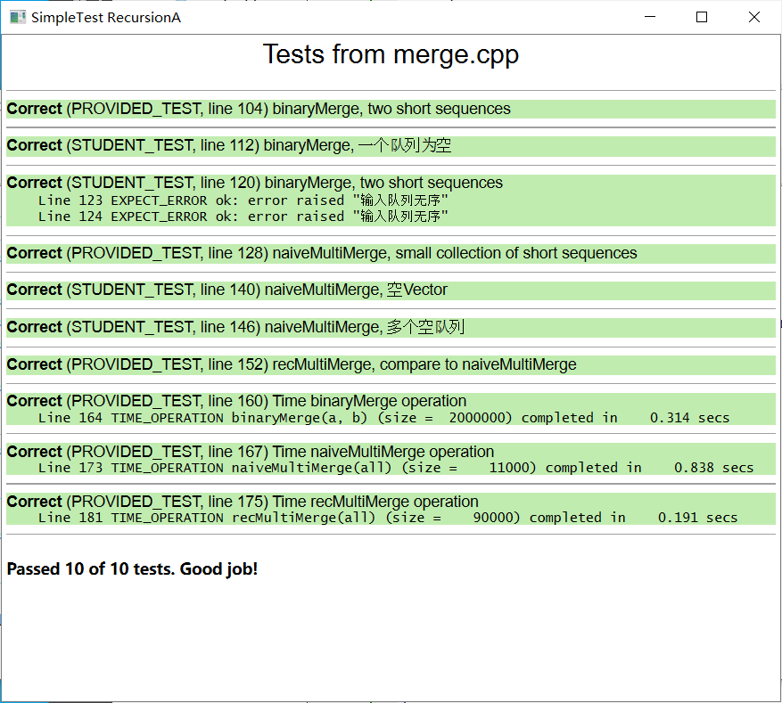

# Assign 3.1

10/13/2022 12:44 AM

### 1. [Fundamental Recursion Warmup](https://web.stanford.edu/class/archive/cs/cs106b/cs106b.1228/assignments/3-recursion/fundamental-warmup)

### 2. [Balanced Operators](https://web.stanford.edu/class/archive/cs/cs106b/cs106b.1228/assignments/3-recursion/balanced)

### 3. [Sierpinski Fractal](https://web.stanford.edu/class/archive/cs/cs106b/cs106b.1228/assignments/3-recursion/sierpinski)

### 4. [Merging Sorted Sequences](https://web.stanford.edu/class/archive/cs/cs106b/cs106b.1228/assignments/3-recursion/merge)

